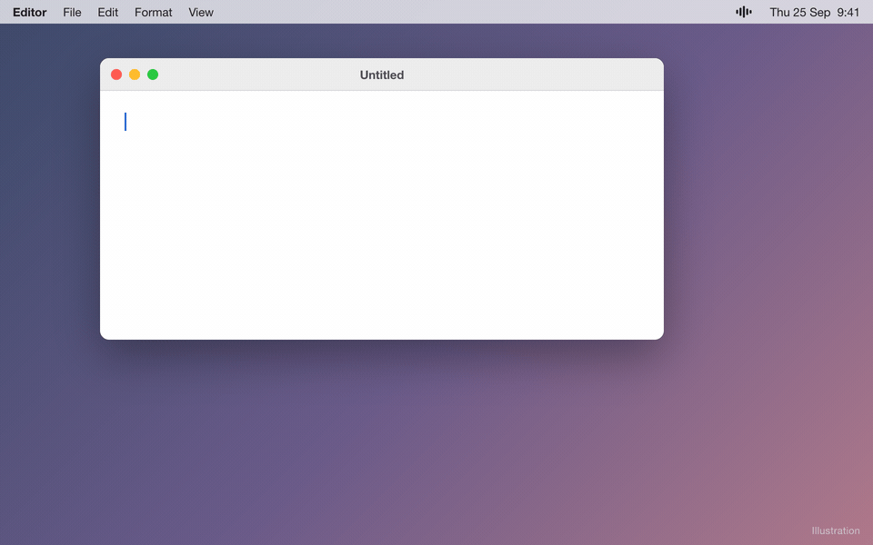

# MyWhisper

**Private, on-device voice dictation for macOS that understands how people actually talk, including when they switch between two languages mid-sentence.**

<p align="center">
  
</p>
<p align="center"><sub>Illustration of the flow, not a screen recording (regenerate with <code>scripts/demo/make-gif.sh</code>).</sub></p>

Tap **⌥Space**, speak, tap again, and the text is typed into whatever app you're in. Speech recognition runs locally through [whisper.cpp](https://github.com/ggml-org/whisper.cpp). No account, no cloud, no telemetry.

Apple Silicon · macOS 13+ · free and open source (MIT)

## What makes it different

- **Mixed-language packs for code-switching.** Five dedicated modes for speech that mixes English with **Indonesian, Tagalog, Hindi, Spanish, or Chinese** ("tolong follow up client besok"). Whisper normally assumes a single language per recording. Each pack pins the primary language and primes the decoder with a code-switched example, so the English words stay English instead of being mistranscribed.
- **Fully on-device.** Audio goes to a `whisper-server` process the app launches on `127.0.0.1`, never to a remote service. After the one-time model download it works offline.
- **Self-learning corrections.** Fix a transcript once in **History → Correct…** and MyWhisper derives a replacement rule from your edit, so the next dictation gets it right automatically.
- **Local AI modes.** Optionally rewrite dictation as an **Email**, **Message**, or **Bullet Notes** using a model running in your own [Ollama](https://ollama.com). Before sending any text, the app checks that the endpoint on `127.0.0.1:11434` really is Ollama. If the AI step fails, you still get the raw transcript.
- **Privacy enforced by a test.** [`NetworkAuditTests`](Tests/MyWhisperTests/NetworkAuditTests.swift) scans every source file and fails the build if a non-localhost URL appears anywhere except two pinned exceptions: the user-initiated model download from Hugging Face, and a "Get Ollama" link that opens in your browser. Details and limits are in [PRIVACY.md](PRIVACY.md).

## Everything else

- Tap to toggle, or hold the hotkey to talk while held. **Esc** cancels. The hotkey can be changed.
- Auto-detect across Whisper's ~100 languages, or pin one of 22 common languages from the menu.
- Live preview while you speak, plus **instant paste**, which reuses the preview to skip a second transcription pass.
- Voice commands ("new line", "scratch that", …) and spoken punctuation.
- Per-app profiles, for example Message mode in Slack and Email mode in Mail.
- History, custom vocabulary, text replacements, and translate-to-English.
- Transcribe audio files (wav/mp3/m4a) from the menu or the command line.
- A first-run Setup Assistant that handles permissions and model downloads, and a Settings window (⌘,).
- Two engines: the default `whisper-server` subprocess, or an experimental in-process `libwhisper`.

## Install

### Download (no developer tools needed)

1. Download the latest `MyWhisper-x.y.z.dmg` from [Releases](https://github.com/ronimoe/my-whisper/releases/latest).
2. Open the DMG and drag **MyWhisper.app** into **Applications**.
3. Open it. macOS shows **"MyWhisper.app" Not Opened** with only *Move to Trash* and *Done*. This is Apple's standard warning for any app that isn't notarized (notarization requires a $99/yr developer account); it doesn't mean the app is broken. To open it anyway:
   - Click **Done**, **not** *Move to Trash*.
   - Open **System Settings → Privacy & Security**, scroll to the bottom, click **Open Anyway** next to the MyWhisper message, and confirm (macOS may ask for your password or Touch ID).
   - You only need to do this once.
4. Grant **Microphone** and **Accessibility** access when the Setup Assistant asks. Accessibility is what lets it type into other apps.
5. Tap **⌥Space** and start talking. A small starter model ships inside the app, so this works right away. The Setup Assistant offers the larger, more accurate `large-v3-turbo` model (1.5 GB) as an optional download.

### Build from source

Requirements: Apple Silicon Mac, macOS 13+, [Homebrew](https://brew.sh), and Xcode or the Command Line Tools (running the tests needs full Xcode).

```sh
git clone https://github.com/ronimoe/my-whisper.git
cd my-whisper
brew install whisper-cpp   # transcription engine + library
make model                 # download the recommended model (~1.5 GB)
make run                   # build build/MyWhisper.app and launch it
```

The source build is ad-hoc signed, so macOS asks you to grant Accessibility again after each rebuild. Other useful targets:

```sh
make test                                            # run the test suite (needs full Xcode)
.build/release/MyWhisper --transcribe clip.m4a       # headless CLI transcription
```

To build a self-contained DMG like the release (vendored `whisper-server` plus bundled starter model), see [docs/RELEASE.md](docs/RELEASE.md).

## How it works

```
hotkey ─▶ record mic (AVAudioEngine, 16 kHz mono)
       ─▶ whisper-server on 127.0.0.1 (whisper.cpp, Metal)   ── language / Mixed pack prompt
       ─▶ post-processing: your replacement rules, voice commands, spoken punctuation
       ─▶ optional AI mode via local Ollama (127.0.0.1:11434)
       ─▶ typed into the frontmost app (Accessibility)
```

Models live in `~/Library/Application Support/MyWhisper/models/`. History, settings, and rules are plain files in the same folder, readable only by your user account. The full design is in [docs/ARCHITECTURE.md](docs/ARCHITECTURE.md).

## Models

| Model | Size | Multilingual quality | Notes |
|---|---|---|---|
| small (q5_1) | 181 MB | okay | bundled starter in the DMG |
| medium | 1.5 GB | good | |
| large-v3-turbo | 1.5 GB | near-best | **recommended** |
| large-v3 | 2.9 GB | best | slower; use this (or medium) for Translate-to-English |

Download with `make model MODEL=<name>` or from the Setup Assistant. `large-v3-turbo` cannot translate.

## Documentation

| Doc | Contents |
|---|---|
| [User Guide](docs/USER-GUIDE.md) | Every menu item and setting, languages, voice commands, AI modes, CLI, troubleshooting |
| [Architecture](docs/ARCHITECTURE.md) | Data flow, engines, concurrency, file/permission model, test strategy |
| [Development](docs/DEVELOPMENT.md) | Makefile targets, scripts, conventions, how-to recipes |
| [Product](docs/PRODUCT.md) | Vision, feature inventory, roadmap |
| [Release](docs/RELEASE.md) | Building and shipping the DMG |
| [Porting](docs/PORTING.md) / [iPad](docs/IPAD.md) | Scoping for other platforms |
| [Privacy](PRIVACY.md) | What runs where, and how it's checked |

## Testing

310 XCTest tests across 25 test files, run with `make test`. They cover the dictation pipeline, the Mixed-language packs, corrections, AI-mode fallbacks, settings, and the network audit. See [ARCHITECTURE.md § test strategy](docs/ARCHITECTURE.md#test-strategy).

## Contributing and security

Contributions are welcome. Start with [CONTRIBUTING.md](CONTRIBUTING.md). To report a vulnerability, use GitHub private vulnerability reporting as described in [SECURITY.md](SECURITY.md).

## License and credits

MyWhisper is released under the [MIT License](LICENSE). Copyright (c) 2026 Roni Moe.

It builds on:

- [whisper.cpp](https://github.com/ggml-org/whisper.cpp) and ggml by the ggml authors (MIT). The release DMG bundles `whisper-server`.
- [OpenAI Whisper](https://github.com/openai/whisper) model weights (MIT), in the ggml conversions [hosted on Hugging Face](https://huggingface.co/ggerganov/whisper.cpp). The release DMG bundles the small starter model.
- [Ollama](https://ollama.com) (MIT), optional and installed separately, for AI modes.

Full license texts are in [THIRD_PARTY_NOTICES.md](THIRD_PARTY_NOTICES.md) and inside the app bundle.
